# Pix2Pix-
Using pix2pix GAN to do Image translation from MRI magnitude image to its corresponding phase Image

## Requirements:
  * Python >= 3.5
  * Keras

**Ongoing Project**

Some images from the dataset:-

**MRI Magnitude Image**

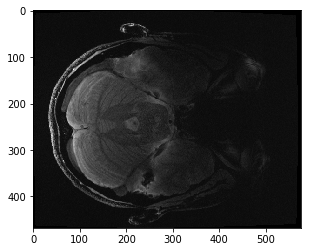 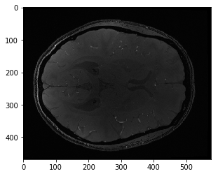 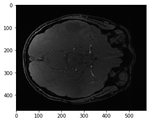

**MRI Phase Image**

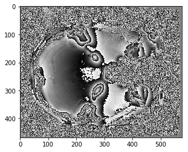  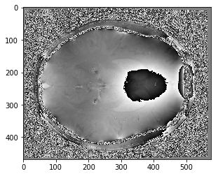  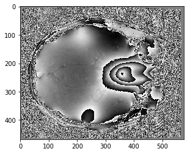

**As a sanity check I first train the network on 1/10th of the dataset that I have, and for the sake of simplicity I also resized the image to (256,256), and the results are the following**

**Magnitude Image**                           

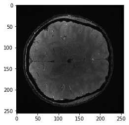   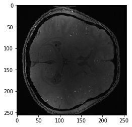

**Actual Phase Image**

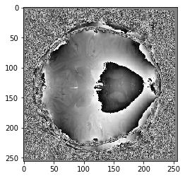   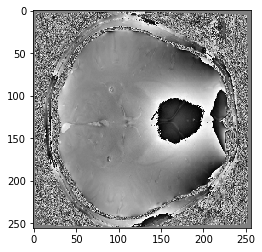

**Predicted Phase Image**

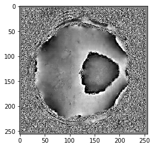    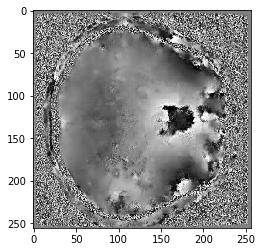

  
